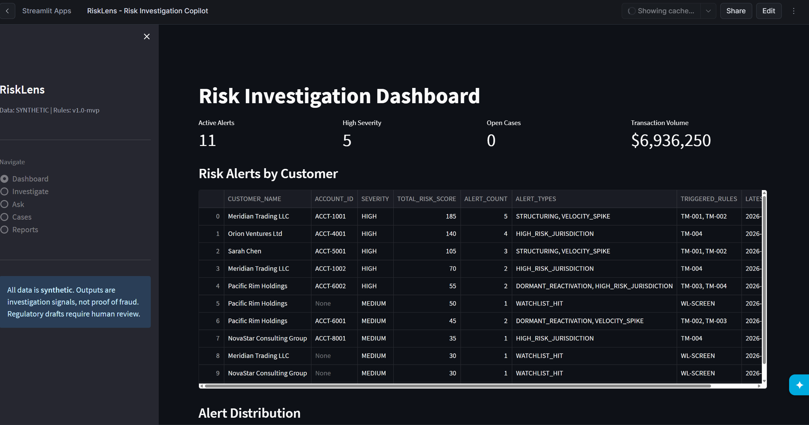
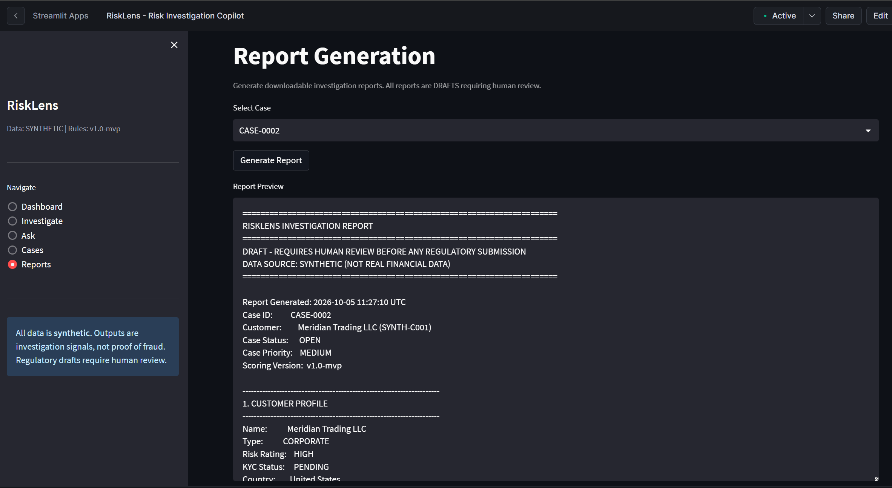
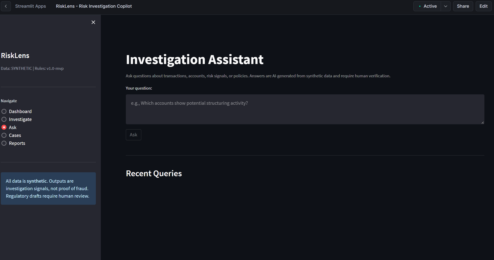
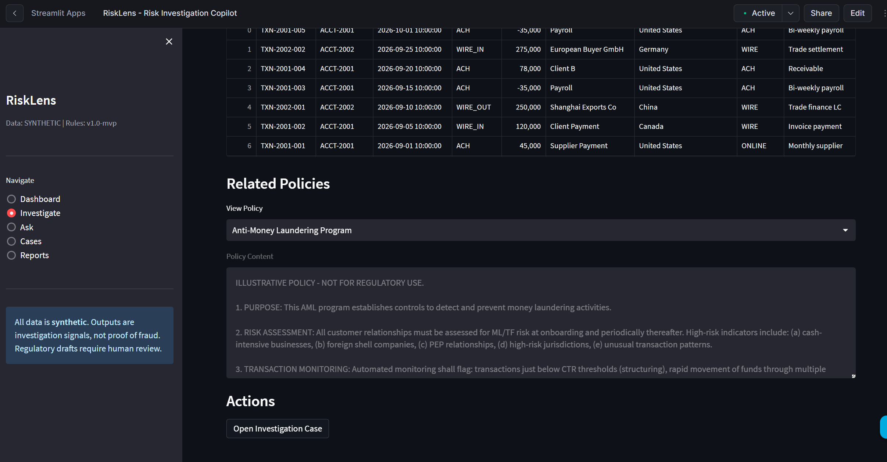
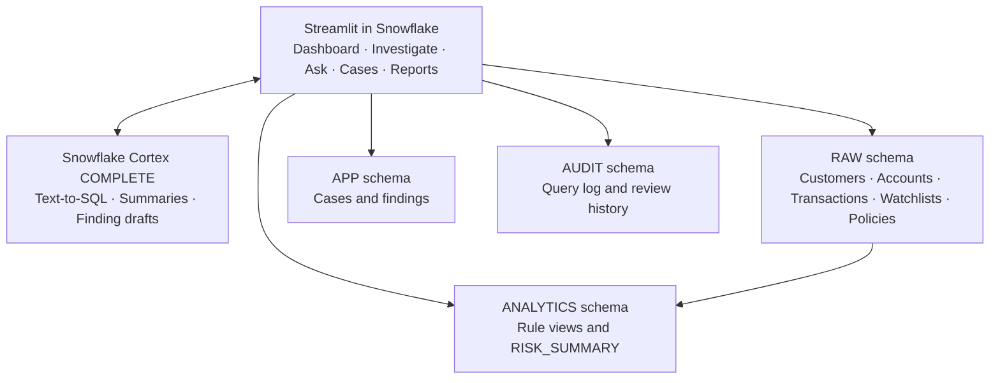

# RiskLens: Risk Investigation Copilot

**A Snowflake-native MVP for AML and suspicious-transaction investigations.**

RiskLens flags risk signals using deterministic SQL rules and lets analysts ask natural-language questions, inspect evidence, manage cases, draft findings with AI assistance, and download draft investigation reports.

<table>
  <tr>
    <td width="50%">
      
    </td>
    <td width="50%">
      
    </td>
  </tr>
  <tr>
    <td width="50%">
      
    </td>
    <td width="50%">
      
    </td>
  </tr>
</table>

> **Prototype disclaimer:** All data is synthetic. Policy documents are illustrative and are not real regulatory text. Risk signals are reasons to investigate, not proof of fraud. Reports are drafts that require human review. Nothing is submitted to a regulator.

## Table of Contents

- [Overview](#overview)
- [Investigation Workflow](#investigation-workflow)
- [Architecture](#architecture)
- [Risk Rules](#risk-rules)
- [Synthetic Dataset](#synthetic-dataset)
- [Technology Stack](#technology-stack)
- [Validation and Testing](#validation-and-testing)
- [Known Limitations](#known-limitations)
- [Snowflake Objects](#snowflake-objects)
- [Production Readiness Checklist](#production-readiness-checklist)
- [Cleanup](#cleanup)

## Overview

### Business Problem

AML analysts often collect transactions, rule hits, customer profiles, and policy text manually before documenting an investigation finding.

RiskLens brings these activities into one workspace, covering the path from a risk signal to supporting evidence, a documented finding, and a draft report.

### Intended Users

- Compliance analysts and investigators at banks and non-banking financial companies (NBFCs).
- Reviewers who need traceable evidence and investigation history.

### AI's Role

AI supports question interpretation, answer summaries, and finding drafts. Risk scores are calculated using deterministic SQL rules.

### Current Scope

The MVP focuses on AML and suspicious-transaction investigations.

Credit watchlists, liquidity exceptions, regulatory submission, and jurisdiction-specific compliance certification are outside the current scope.

## Investigation Workflow

| Step | What Happens |
| --- | --- |
| **Signal** | SQL views apply fixed monitoring rules to transactions and customers. |
| **Evidence** | Analysts inspect triggering transactions, rule IDs, rule versions, watchlist matches, and related policies. |
| **Question** | An LLM converts a natural-language question into a read-only SQL query, which is checked, executed, and summarized. |
| **Case** | Analysts open cases and update their status, priority, and assignee. |
| **Finding** | Analysts write a finding narrative, optionally starting with an AI-generated draft, and save it as `DRAFT`. |
| **Report** | A downloadable plain-text report includes sources, rule versions, timestamps, and recorded review history. |

> SQL validation is basic in this MVP and should not be treated as a security boundary.

## Architecture



The application is deployed as:

```text
RISKLENS.APP.RISKLENS_APP
```

The `ANALYTICS` schema contains these rule and scoring views:

- `STRUCTURING_ALERTS`
- `VELOCITY_ALERTS`
- `DORMANT_REACTIVATION_ALERTS`
- `JURISDICTION_ALERTS`
- `WATCHLIST_ALERTS`
- `RISK_SUMMARY`

Everything runs inside one Snowflake account, with no external services or continuously running application processes.

Warehouse compute uses the existing X-Small `COMPUTE_WH`, configured to auto-suspend after 300 seconds. Cortex inference also consumes credits; total usage has not been measured.

## Risk Rules

**Rule version:** `v1.0-mvp`

| Rule | Detection Logic | Points |
| --- | --- | --- |
| **TM-001: Structuring** | Two or more cash transactions of $3,000–$9,999 on one account in one day, totaling at least $10,000. | 40 |
| **TM-002: Velocity Spike** | Seven-day transaction count exceeds three times the account's prior weekly baseline, looking back up to 90 days. | 25 |
| **TM-003: Dormant Reactivation** | A gap of at least 60 days between transactions, followed by activity in the last 30 days. | 20 |
| **TM-004: High-Risk Jurisdiction** | A wire of at least $25,000 to or from a country on a hardcoded illustrative list. | 35 |
| **WL-SCREEN: Watchlist Match** | Jaro-Winkler name similarity of at least 75 against a watchlist entry. | 50 for sanctions lists; 30 otherwise |

### Severity Thresholds

| Total Points | Severity |
| --- | --- |
| Above 50 | **HIGH** |
| 30–50 | **MEDIUM** |
| Below 30 | **LOW** |

Points are summed per account across every alert row. Repeated alerts across multiple days increase the total score.

Scores are **not capped or deduplicated** and are not calibrated probabilities of fraud.

> Rules `TM-005` and `TM-006` appear in the illustrative policy documents but are not implemented.

## Synthetic Dataset

| Item | Count |
| --- | --- |
| Customers | 8 |
| Accounts | 15 |
| Transactions | 70 |
| Watchlist entries | 5 |
| Illustrative policies | 7 |

The illustrative policies cover AML, CTR, SAR, KYC, monitoring thresholds, jurisdictions, and record retention.

### Included Scenarios

| Scenario | Synthetic Customer |
| --- | --- |
| Structuring | Meridian Trading |
| Wires involving high-risk jurisdictions | Orion Ventures |
| Transaction velocity spike | Sarah Chen |
| Dormant reactivation and sanctions-list name match | Pacific Rim Holdings |
| PEP-adjacent watchlist match | NovaStar |
| Clean controls | Additional synthetic customers |

## Technology Stack

| Technology | Purpose |
| --- | --- |
| **Snowflake** | Tables, views, internal staging, and deployment stored procedures. |
| **Streamlit in Snowflake** | Analyst-facing application interface. |
| **Snowflake Cortex `COMPLETE`** | Natural-language question interpretation, answer summaries, and finding drafts. |
| **`llama3.1-70b`** | Model used by the MVP's Cortex calls. |
| **Snowflake `JAROWINKLER_SIMILARITY`** | Fuzzy watchlist name matching. |
| **Cortex Code in VS Code** | Development and deployment assistance. |

### Environment Check Notes

During the project's environment checks, `EXTRACT_ANSWER`, `SUMMARIZE`, `SENTIMENT`, and `CLASSIFY_TEXT` worked in the account, but the application does not use them.

The following models were unavailable or retired in the tested account:

- `snowflake-arctic`
- `mistral-large2`
- `claude-3-5-sonnet`
- `llama3.2-3b`

These observations describe the tested environment and are not a general model-availability guarantee.

## Validation and Testing

Validation consisted of manual SQL checks and visual checks in the application.

### Rule View Results

| Rule View | Observed Alert Rows |
| --- | --- |
| Structuring | 6 |
| Velocity | 3 |
| Dormant reactivation | 2 |
| Jurisdiction | 8 |
| Watchlist | 4 |

The composite scoring view returned **11 summary rows**.

### Additional Checks

- Cortex text-to-SQL generated valid SQL for a sample question.
- The generated query executed successfully.
- The Streamlit application was deployed.
- A Streamlit version incompatibility involving `hide_index` was fixed.

> **There is no automated test suite.** These checks demonstrate behavior on the small synthetic dataset and do not establish production readiness.

## Known Limitations

### Authorization and Access Control

- The MVP was built and runs as `ACCOUNTADMIN`.
- There are no dedicated application roles or row-level security policies.
- Document access is not restricted separately.
- The effective execution and data-access permissions require validation before broader deployment.

### Human Review

- `REVIEW_HISTORY` records case status changes, finding creation, and report generation.
- Findings do not have an approve/reject workflow.
- `REVIEWED_BY` and `REVIEWED_AT` remain unpopulated.

### SQL Safety

- Queries use f-strings and single-quote escaping rather than bind parameters.
- LLM-generated SQL is checked using a basic keyword filter.
- This filtering is insufficient as a production security boundary.

### Text-to-SQL Accuracy

- The model sometimes returns Markdown-fenced SQL, which the application strips.
- Complex questions may produce incorrect queries.

### Policy Retrieval

- Users select policies manually; policies are not retrieved by relevance.
- Policy text is not passed to the LLM when it answers questions.
- The application does not use Cortex Search.

### Cortex Agents

- `SHOW CORTEX AGENTS` returned a syntax error during the account checks.
- The MVP does not use Cortex Agents.

### ID Generation

- Case and finding IDs are based on row counts.
- Concurrent users can cause ID collisions.

### Reporting

- Reports are plain text.
- PDF export is not implemented.
- Reports do not use an approved regulatory template.

### Repository and Deployment

- Deployment used a staging table and stored procedure because the `snow` CLI and Python were unavailable locally.
- The local `streamlit/app.py` contains text-encoding damage in decorative comment lines.
- The local file differs from the deployed version, which removed dataframe styling.
- The deployed code should be re-exported and reconciled before committing it.

### Cost Controls

- Credit usage was not measured.
- The design uses a small warehouse, a small dataset, and user-triggered LLM calls to limit consumption.
- There is no hard spending cap.

## Snowflake Objects

| Object | Description |
| --- | --- |
| `RISKLENS` | Database containing the `RAW`, `ANALYTICS`, `APP`, and `AUDIT` schemas. |
| 9 application and data tables | Customers, accounts, transactions, watchlists, policies, cases, findings, query log, and review history. |
| `RISKLENS.APP.FILE_STAGING` | Additional table used for deployment. |
| 6 analytics views | Five rule views and one composite scoring view. |
| `RISKLENS.APP.STREAMLIT_STAGE` | Internal stage for application files. |
| `DEPLOY_FILE_TO_STAGE` | Deployment stored procedure. |
| `STAGE_FROM_TABLE` | Deployment stored procedure. |
| `RISKLENS.APP.RISKLENS_APP` | Streamlit application. |

## Production Readiness Checklist

Complete these steps before using real data:

- [ ] Create least-privilege roles and stop running the application as `ACCOUNTADMIN`.
- [ ] Add row-level security and appropriate document-access controls.
- [ ] Replace string-built queries with parameterized queries.
- [ ] Establish SQL access controls and query validation; evaluate semantic views and Cortex Analyst where appropriate.
- [ ] Add an explicit approve/reject workflow for findings.
- [ ] Make audit records append-only.
- [ ] Select a jurisdiction and validate thresholds and country lists against current official sources.
- [ ] Adopt approved reporting templates and obtain legal or compliance sign-off.
- [ ] Retrieve relevant policy passages and include citations in generated answers.
- [ ] Add automated tests.
- [ ] Replace row-count-based IDs with concurrency-safe identifiers.
- [ ] Reconcile local source code with the deployed application.
- [ ] Create a reproducible deployment using the `snow` CLI and version-controlled SQL scripts.
- [ ] Measure credit consumption and configure appropriate cost monitoring and controls.

## Cleanup

> **Destructive operation:** The command below drops the `RISKLENS` database and its contained objects. Run it only when you intend to remove the MVP.

```sql
DROP DATABASE RISKLENS;
```
